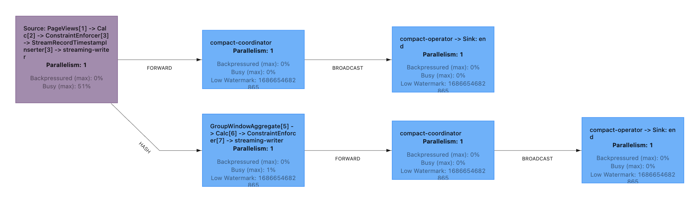
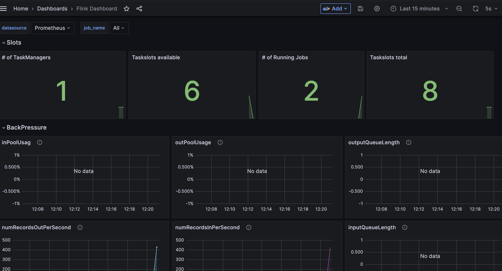

## Take Home Test

### Solution technology:

While my initial impulse was to use Kafka Streams or KSQL for this task, I instead opted for using Flink as it provided 
immediate support for the sink aspect of the test itself (S3 / Filesystem). This way I dont need to run both a stream 
job AND a connect sink.
 
### Discussion

I've built the [Data Generation](src/main/java/com/checkout/datagen/DataGen.java) component using the Flink built in 
DataGen utility. This lets me control the data generation as well as the rate. 
In this file, I've also demonstrated a simple UDF to transform a random number into an option.

For the actual test component, the [Aggregation Pipeline](src/main/java/com/checkout/aggregation/AggregationPipeline.java)
, I've built it as a split pipeline using the same consumer group for writing both the View Event sink, as well as the 
Aggregation Sink. This way, if an error occurs, they'll only continue together and avoids drift. It also demonstrates a 
slightly more complex pipeline.

I've used the in-memory catalog, once again, as it's simple and can be included. This is represented in the [Catalog](src/main/java/com/checkout/tables/Catalog.java) 
java file, and again in the [sql catalog](docker/flink/catalog.sql). In production, we could use Glue, as the iceberg connector provides that capacity out of ther box. 

For both sinks, I've partitioned by date and hour, though this can easily be changed as seen in the code (I hope).
The files should go into the ./data directory on run (check the docker-compose volume)

I chose to use default jsonl format, as it's easier to read, and local as we dont need to configure S3 access.
Though I'd use parquet or orc format in production (orc handles deep nesting better, in flink). We'd need to 
configure the hadoop libraries and connectors, but that would be simple enough, though it does make the images pretty large. 

Tests are in the usual place. 

As an aside, this could have all been a couple of SQL files as well, but there would be less testability.
Filesystem rollover times are ridiculously low, but that is more so that it's simpler to see it running. 
Also, the rate of messages is at 1000ps. 

### Building the pipeline

I've used gradle for dependencies and building. I've also created a Makefile to simplify common 
tasks. 

Available targets are: 
 * make clean - do some build cleanup
 * make jar - build the pipeline jat
 * make test - runs tests
 * make docker-images - builds the docker requisite docker images
 * make build - builds the jar and the docker images
 * make run - runs docker compose
 * make all - cleans, builds and runs
 * make sql - opens up the flink SQL client to experiment with.

Note: If playing with the SQL client, and using the PageViews table, switch to stream mode.
[Docs](https://nightlies.apache.org/flink/flink-docs-master/docs/dev/table/sqlclient/)

When run the docker compose will start:
 * Zookeeper
 * Kafka
 * Flink Jobmanager
 * Flink Taskmanager
 * Prometheus
 * Grafana
And a once off run of the Flink Taskrunner - this submits our 2 pipelines.

You should be able to access:
 * the Flink UI on localhost:8082, you can watch the tasks run there.
 * grafana on locahost:3000 - I've added some monitoring there using prometheus and grafana.
   * Login using admin/admin. 
   * There should be 2 dashboards preconfigured. One Kafka, one Flink
   * These dashboards are really rudimentary, we should ideally have a dashboard for each pipeline / job, showing 
   kafka lag, error and the like. I ran out of time :).

